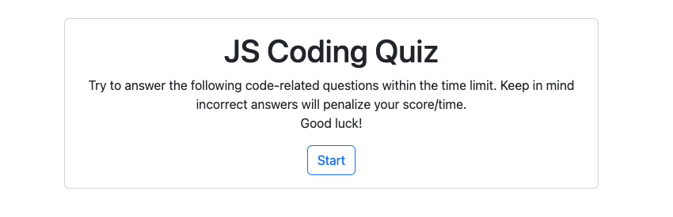
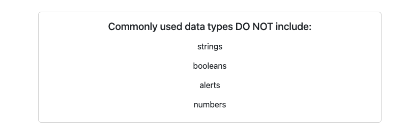

# Web APIs: Code Quiz

## Description
A timed multiple choice quiz about JavaScript. 

## Installation
link to deployed application: https://coterone.github.io/JavascriptQuiz/

## Usage
When the user clicks on the ‘Start’ button the first question comes up on the screen and the timer begins. 

The user gets 75 seconds on the clock to answer 5 questions. 

Each wrong answer deducts 10 seconds from the timer. 

When all the questions are completed, or when the timer runs out , the user’s score will be displayed with the option to save your score.

   
  
   
  
## Questions
If you have any questions about the project, you can reach me via coteroneric@gmail.com | https://github.com/coterone
